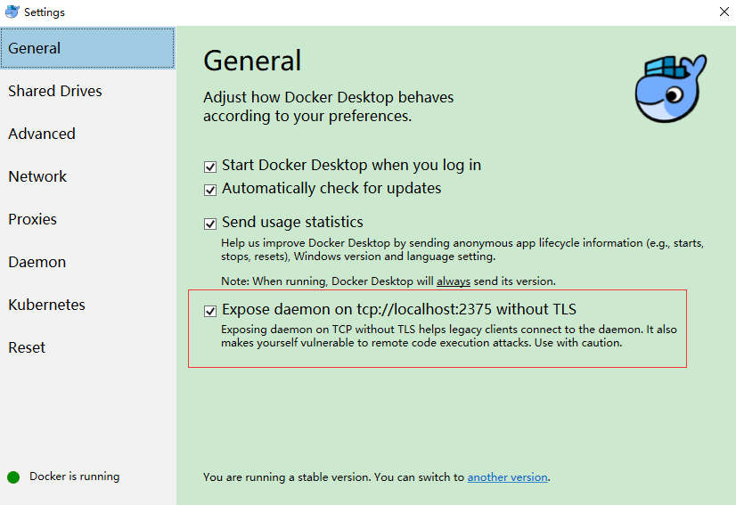
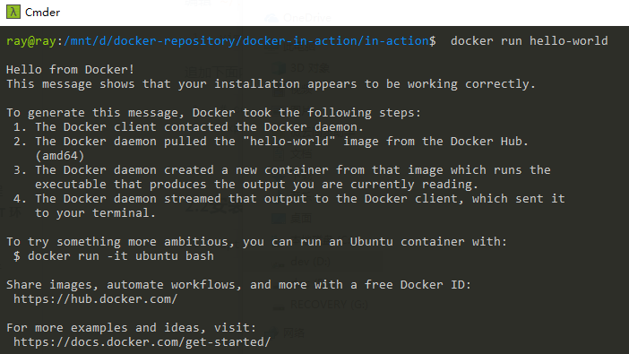

[TOC]


# 前言


# 一、Ubuntu 安装Docker CE 

## 1.检查内核版本

Docker目前只能运行在64位平台上，并且要求内核版本不低于3.10，实际上内核越新越好，过低的内核版本容易造成功能不稳定。

用户可以通过如下命令检查自己的内核版本详细信息：

```
uname -a
```


## 2.卸载旧版本

旧版本的 Docker 称为 `docker` 或者 `docker-engine`，使用以下命令卸载旧版本：

```
sudo apt-get remove docker docker-engine docker.io containerd runc
```


## 3.设置使用的仓库

在新机器上初次安装Docker 前，需要先设置 Docker Repository ，然后你就可以从这个 Repository 中安装和更新 Dokcer了。

（1）更新 apt 包索引

```bash
sudo apt-get update
```


（2）由于 `apt` 源使用 HTTPS 以确保软件下载过程中不被篡改。因此，我们首先需要添加使用 HTTPS 传输的软件包以及 CA 证书。

```bash
sudo apt-get install \
    apt-transport-https \
    ca-certificates \
    curl \
    gnupg-agent \
    software-properties-common
```


（3）为了确认所下载软件包的合法性，需要添加软件源的 `GPG` 密钥。

```bash
$ curl -fsSL https://mirrors.ustc.edu.cn/docker-ce/linux/ubuntu/gpg | sudo apt-key add -


# 官方源
# $ curl -fsSL https://download.docker.com/linux/ubuntu/gpg | sudo apt-key add -
```


现在可以验证你是否有带有指纹的秘钥： `9DC8 5822 9FC7 DD38 854A E2D8 8D81 803C 0EBF CD88`，执行如下命令，根据秘钥的最后8位字符来查看秘钥

```bash
$ sudo apt-key fingerprint 0EBFCD88
    
pub   rsa4096 2017-02-22 [SCEA]
      9DC8 5822 9FC7 DD38 854A  E2D8 8D81 803C 0EBF CD88
uid           [ unknown] Docker Release (CE deb) <docker@docker.com>
sub   rsa4096 2017-02-22 [S]
```


（3）然后，我们需要向 `source.list` 中添加 Docker 软件源

```bash
$ sudo add-apt-repository \
    "deb [arch=amd64] https://mirrors.ustc.edu.cn/docker-ce/linux/ubuntu \
    $(lsb_release -cs) \
    stable"


# 官方源
# $ sudo add-apt-repository \
#    "deb [arch=amd64] https://download.docker.com/linux/ubuntu \
#    $(lsb_release -cs) \
#    stable"
```


> 以上命令会添加稳定版本的 Docker CE APT 镜像源，如果需要测试或每日构建版本的 Docker CE 请将 stable 改为 test 或者 nightly。


## 4.安装 Docker CE

（1）更新 apt 包索引

```
sudo apt-get update
```


（2）安装 Docker CE 和 containerd 最新版本

```
sudo apt-get install docker-ce docker-ce-cli containerd.io
```


（3）若要安装指定版本的 Docker CE 和 containerd 

> - 列出仓库中可用的版本列表
>
>     ```bash
>     $ apt-cache madison docker-ce
>     
>       docker-ce | 5:18.09.1~3-0~ubuntu-xenial | https://download.docker.com/linux/ubuntu  xenial/stable amd64 Packages
>       docker-ce | 5:18.09.0~3-0~ubuntu-xenial | https://download.docker.com/linux/ubuntu  xenial/stable amd64 Packages
>       docker-ce | 18.06.1~ce~3-0~ubuntu       | https://download.docker.com/linux/ubuntu  xenial/stable amd64 Packages
>       docker-ce | 18.06.0~ce~3-0~ubuntu       | https://download.docker.com/linux/ubuntu  xenial/stable amd64 Packages
>       ...
>     ```
>
>     第二列就是版本
>
>     
>
> - 指定版本进行安装
>
>     ```bash
>     $ sudo apt-get install docker-ce=<VERSION_STRING> docker-ce-cli=<VERSION_STRING> containerd.io
>     ```
>
>     例如安装`5:18.09.1~3-0~ubuntu-xenial`版本的
>
>     ```bash
>     $ sudo apt-get install docker-ce=5:18.09.1~3-0~ubuntu-xenial docker-ce-cli=5:18.09.1~3-0~ubuntu-xenial containerd.io
>     ```
>
>     


## 5.验证是否安装成功

（1）首先启动 docker 服务

```
service docker start
```


（2）然后，我们就通过运行 `hello-world`来验证是否安装成功

```bash
$ sudo docker run hello-world
```


# 二、WSL上使用docker

windows 用户建议先安装 WSL （适用于Windowd的Linux子系统），安装教程参考：[02-命令行工具.md](../dev-tools/02-命令行工具.md)


　**不过令人遗憾的是目前WSL是不支持Docker的守护进程**，但您可以使用[Docker CLI](https://nickjanetakis.com/blog/get-to-know-dockers-ecosystem#docker-cli)连接到通过[Docker for Windows](https://nickjanetakis.com/blog/should-you-use-the-docker-toolbox-or-docker-for-mac-windows)或您创建的任何其他VM 运行的远程Docker守护进程

## 1.安装WSL

参考 [02-命令行工具.md](../dev-tools/02-命令行工具.md)

## 2.安装Docker Desktop for Windows

（1）去官网下载 [Docker Desktop for Windows](https://hub.docker.com/editions/community/docker-ce-desktop-windows)


（2）然后在控制面板-> 程序和功能 -> 启用或关闭Window功能 -> 勾选 Hyper-V


（3）然后一路默认安装即可


（4）暴露守护进程端口，以便让 docker 客户端进行连接Docker守护进程




## 3.WSL连接Dokcer守护进程

> 关于Linux环境变量持久化，请参见[Linux_04_环境变量](../Linux/Linux_01_基础知识/Linux_04_环境变量.md)


### 3.1 配置 DOCKER_HOST 环境变量

我们配置一个 DOCKER_HOST 环境变量，指定下Docker守护进程的地址


编辑 `~/.bashrc`

```
vim ~/.bashrc
```

追加下面内容

```
# config for the docker client to connect docker daemon
export DOCKER_HOST=tcp://127.0.0.1:2375
```


### 3.2 安装 docker 客户端

```
apt install docker.io
```


## 4.验证WSL是否能成功运行Docker

我们就通过运行 `hello-world`来验证是否安装成功

```
 sudo docker run hello-world
```


发现已经可以运行Docker了




# 三、配置docker

为了避免每次使用docker命令都要用特权身份，可以将当前用户加入安装中自动创建的docker用户组：

```
sudo usermod -aG docker USER_NAME
```

如：

```
sudo usermod -aG docker ray
```


# 参考资料

1. [Get Docker CE for Ubuntu](https://docs.docker.com/install/linux/docker-ce/ubuntu/)
2. [在Linux的Windows子系统上(WSL)使用Docker（Ubuntu）](https://www.cnblogs.com/xiaoliangge/p/9134585.html)
3. [Docker 技术入门与实战](https://item.jd.com/12453318.html)
4. 


